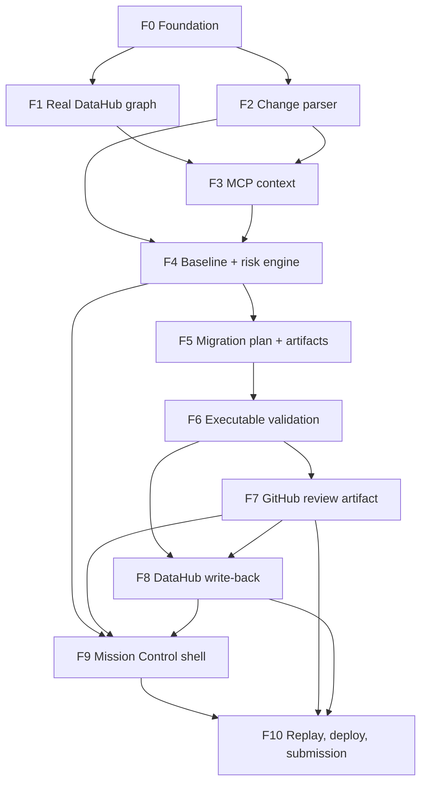

# LineageGuard Delivery Design

**Date:** 2026-08-03
**Status:** Approved on 2026-08-04
**Session boundary:** Local F0 execution is authorized; do not begin F1 automatically or perform external mutations
**Deadline:** 2026-08-10 17:00 EDT / 23:00 Europe/Madrid

## 1. Decision summary

Implement the accepted canonical vertical slice in gate-first order. Prove the real DataHub graph and the deterministic `ALLOW -> BLOCK` decision before investing in generation, side effects, or UI polish. Use one TypeScript control plane, a separate worker, PostgreSQL-backed durable state, the official DataHub MCP server, a narrow OpenAI Agents SDK integration, a disposable validation database, and honest replay generated from a real validated run.

The implementation sequence remains F0 through F10, with four non-negotiable evidence gates:

1. the canonical graph exists in real DataHub OSS;
2. repository-only evidence produces `ALLOW`, while normalized DataHub evidence produces `BLOCK`;
3. the safe migration passes executable validation and a deliberately broken artifact fails;
4. a real GitHub review artifact and verified DataHub write-back exist before the UI is called complete.

This design confirms ADR-001 and ADR-002. Its approval accepts the direction for three follow-up ADRs that F0 will record before affected implementation begins:

- ADR-003: DataHub MCP version, transport, and separate read/write capability boundaries;
- ADR-004: PostgreSQL workflow claiming, event delivery, and side-effect idempotency;
- ADR-005: demo deployment exposure, operator authorization, replay mode, and external-mutation policy.

## 2. Brainstorming validation

The accepted product vision is still the strongest implementation target. It maps directly to the hackathon's equally weighted criteria:

| Judging criterion | LineageGuard proof |
|---|---|
| Use of DataHub | Field/table lineage, query history, ownership and governance evidence change the decision; the verified migration decision is written back. |
| Technical execution | Deterministic policy, structured model output, executable dbt/PostgreSQL validation, durable events, idempotent side effects, and one-command verification. |
| Originality | Converts catalog context into a safe, reviewable migration rather than merely displaying lineage already available in DataHub. |
| Real-world usefulness | Addresses hidden consumers of breaking schema changes and creates artifacts a data team can review. |
| Submission quality | A deterministic sub-three-minute story, public repository, judge-readable artifacts, clean-start instructions, and a hosted replay. |
| Open-source bonus | Optional only after the canonical path is frozen. |

The official rules require a working project, DataHub OSS plus at least one of MCP/Agent Context Kit/DataHub Skills/Analytics Agent, a public Apache-2.0 repository, an accessible project URL through judging, and a video under three minutes. The repository already has an Apache-2.0 `LICENSE`; deployment availability through 2026-08-31 must be budgeted in F10. See the [official overview](https://datahub.devpost.com/) and [official rules](https://datahub.devpost.com/rules).

### Considered delivery approaches

| Approach | Advantages | Failure mode | Decision |
|---|---|---|---|
| **A. Gate-first vertical slice** | Retires DataHub, MCP, policy, validation, and mutation risk in dependency order; produces credible evidence early. | UI appears later; F0/F1 must be aggressively small. | **Recommended.** |
| B. UI/replay first | Fast visual progress and early screenshots. | Encourages a polished mocked path before proving real DataHub context; hides the highest-risk unknowns. | Reject for the critical path; a minimal UI shell may start only after event contracts stabilize. |
| C. Platform/infrastructure first | Broadly reusable foundation and deployment automation. | Consumes the remaining week on generality that the canonical demo does not need. | Reject; deploy only the minimum hosted demo topology. |

No new evidence justifies reopening ADR-001 or ADR-002. No multi-agent product topology, generic migration platform, second polished scenario, or production-scale scheduler is warranted.

## 3. Repository and environment audit

### Repository state

- Current branch: `docs/approved-delivery-plan` (created from `main` at `e4230e5`).
- Current commit: `e4230e5`, aligned with `origin/main` at inspection time.
- History: one linear 12-commit documentation sequence from `c55cf07` (initial planning prompt) through product vision, strategy, architecture, ADRs, storyboard, harness, skills, implementation handoff, and `e4230e5` (engineering foundation); no product-code or merge commits were present.
- Branches: local `main` plus the planning branch `docs/approved-delivery-plan`; no product feature branch exists yet.
- Worktrees: only the current checkout.
- Product implementation: not present; the repository contains foundation and planning documents.
- GitHub repository: `greatkich/lineageguard`; authenticated account `greatkich` has administrator access.
- Existing worktree changes belong to the user and must be preserved:
  - mode-only change on `scripts/bootstrap-agent-tooling.sh` (`0644 -> 0755`);
  - untracked official DataHub skill directories under `.agents/skills/`;
  - untracked `skills-lock.json`.

The user approved preserving the existing dirty tooling artifacts together with this planning packet in one focused planning commit on `docs/approved-delivery-plan`. Product implementation must not begin on `main`.

### Local runtime and tool state

| Capability | Required/planned | Observed | Status |
|---|---|---|---|
| Node.js | 24 LTS | 24.18.0 | Available |
| pnpm | pinned by Corepack | 11.20.0 | Available |
| Python | 3.12 through uv | 3.12.13 through uv (`python3` remains 3.11.3) | Available for F0 |
| uv | pinned project tool | 0.11.32 | Available |
| Docker Engine / Compose | reachable daemon; supported Compose v2 or v5 invoked as `docker compose` | Engine 29.6.2 aarch64; Compose v5.3.1; daemon reachable | Available |
| Free disk | 13 GB official DataHub minimum; 30 GB project operating floor | 36,906,928 KB (approximately 35.2 GiB) | Available for F0 |
| DataHub CLI | pinned 1.6-compatible install | absent | Missing |
| DataHub MCP | configured read and write profiles | absent | Missing |
| dbt / PostgreSQL client | pinned and executable | absent | Missing |
| Biome / Vitest / Playwright | workspace dependencies | absent, expected before F0 | Missing |
| GitHub CLI | authenticated | 2.96.0 | Available |
| Codex CLI | current stable inspected | 0.146.0 | Available |
| Superpowers | current release inspected | skills from 6.2.0 are available, but plugin reports disabled | Configuration anomaly |

DataHub Quickstart is officially tested with 2 CPUs, 8 GB RAM, 2 GB swap, and 13 GB disk. The project should require at least 30 GB free before attempting Quickstart because Docker images, PostgreSQL, package stores, build output, screenshots, and replay artifacts must coexist. If that space cannot be made available before F0 starts, use a Linux VPS immediately rather than spending the critical path on local cleanup. See the [DataHub Quickstart prerequisites](https://docs.datahub.com/docs/quickstart#prerequisites).

### Codex, plugins, skills, and MCP

- Codex 0.146.0 matches the latest official release observed on 2026-08-03.
- Installed/enabled plugins include the document artifact plugins, Browser, Sites, Visualize, Google Calendar, and Slack.
- The GitHub plugin is not installed, although local `gh` access is working and GitHub connector tools are available in this session.
- Superpowers is installed from the curated marketplace but reports `disabled`; its 6.2.0 skills are nevertheless discoverable in this session. Enable it and restart Codex before implementation so future sessions do not depend on cache behavior.
- Relevant engineering skills are present: Superpowers planning/TDD/debugging/review/worktrees, Playwright, security reviews, and the project-local LineageGuard safety skills.
- The repository-local DataHub skills are a complete, attributable 55-file snapshot of eight upstream roots, including `shared-references`, pinned to commit `f22f93074cf265ba6f9401947404f090c2584d9d`. The offline verifier authenticates every file and the reviewed local `datahub-setup` security patch; updates follow `docs/THIRD_PARTY_SKILLS.md`.
- Recommended but absent helper skills from `docs/SKILLS_AND_AGENTS.md`: interactive Playwright and screenshot-specific helpers. Their absence is not a blocker because the installed Playwright and browser capabilities cover the required tests, but the document should be updated to name actual available skills.
- Configured MCP servers observed: Context7, Linear, and OpenAI Developer Docs, plus local runtime services. No DataHub MCP server is configured.

Official Codex guidance confirms that repository skills belong under `.agents/skills`, that plugins package skills/MCP capabilities, and that worktrees isolate branch work. See the [Codex skills documentation](https://learn.chatgpt.com/docs/build-skills) and [Superpowers workflow](https://github.com/obra/superpowers#the-basic-workflow).

### Credentials and external access

The audit found no configured application credentials for OpenAI, DataHub GMS, runtime GitHub mutations, deployment, DNS, or TLS. Secret values were not printed or inspected. The current `gh` token is a broad classic token (`repo`, `workflow`, and related scopes), which does not meet the repository's least-privilege policy for the demo runtime.

F0 may create secret *names* and validation rules, but must not create `.env` files or credentials. Live F1/F5/F7/F8/F10 gates require credentials supplied outside Git.

## 4. Current official technical assumptions

This matrix records the planning snapshot. F0 must lock resolved dependencies and run compatibility smoke tests; it must not blindly upgrade during later features.

| Component | Verified current fact | Project decision |
|---|---|---|
| DataHub OSS | Current documented release is 1.6.0; Quickstart supports `--version v1.6.0` and uses MySQL, Kafka, and OpenSearch. | Pin `v1.6.0`; never use floating Quickstart images. |
| DataHub CLI/ingestion | `acryl-datahub` 1.6.0.17 supports Python 3.12. | Pin `acryl-datahub[postgres]==1.6.0.17` in `tools/datahub/uv.lock`. |
| DataHub MCP | Official self-hosted setup uses `uvx mcp-server-datahub`; current PyPI release is 0.6.0 and mutations require `TOOLS_IS_MUTATION_ENABLED=true`. | Launch `uvx --from mcp-server-datahub==0.6.0 mcp-server-datahub`; use separate read-only and mutation-enabled processes/configurations. |
| DataHub agent skills | Official upstream is Apache-2.0 and the selected snapshot includes `shared-references`. | Keep the committed eight-root snapshot pinned to `f22f93074cf265ba6f9401947404f090c2584d9d`; authenticate all 55 files and the local security patch in `skills-lock.json`, and verify offline. |
| DataHub query evidence | PostgreSQL ingestion can collect query lineage and usage from `pg_stat_statements` on PostgreSQL 13+ with `pg_read_all_stats`, `include_query_lineage`, and `include_usage_statistics`. | Execute the canonical unmanaged query, ingest it, then assert MCP `get_dataset_queries` returns it. |
| DataHub lineage | Column lineage can be explicit or inferred from SQL; column-level creation is supported only for Dataset-to-Dataset edges. | Seed exact field lineage through datasets, then use entity-level edges for dashboards and ML entities. Preserve evidence granularity. |
| OpenAI Agents SDK | The TypeScript SDK supports Zod `outputType`, local/private MCP servers, tracing, guardrails, and resumable approvals. Current package is 0.14.2 with Zod 4 peer support. | Pin `@openai/agents@0.14.2` and `zod@4.4.3`; use the SDK MCP client for deterministic context collection and one combined migration planner/generator Agent, with no additional role absent evaluation evidence and a superseding ADR. |
| Node.js | 24.18.0 is the current Node 24 LTS patch. | Pin 24.18.0. |
| Next.js / React | Stable Next 16.2 requires Node 20.9+ and TypeScript 5.1+; React 19.2 is current. TypeScript 7 support is still experimental in Next 16.3 previews. | Pin Next 16.2.12, React/React DOM 19.2.8, and TypeScript 6.0.3. Do not use TypeScript 7 or canary Next. |
| PostgreSQL | 18.4 is current; 17.10 remains supported through 2029. DataHub query lineage requires only 13+. | Pin PostgreSQL 17.10 for the conservative demo target. |
| dbt Core | Current packages are dbt-core 1.12.0 and dbt-postgres 1.11.0; the adapter declares core `>=1.8,<2.0`. | Pin both exact versions and prove `dbt debug/parse/build` in F0/F1. |
| Python | Python 3.12.13 is the current 3.12 security release; 3.12 is security-fixes-only but mandated by ADR-001. | Pin Python 3.12.13 through current uv; reassess after the hackathon, not during it. |
| uv | Current official installer documentation exposes versioned installation and exact lock/sync modes. | Pin uv 0.11.32 in CI/bootstrap and use `uv run --locked`. |
| Docker Compose | Current Docker documentation supports Compose v2 and v5; both use the Compose Specification and the `docker compose` command. Legacy Compose v1 uses `docker-compose`. | Accept CLI major v2 or v5, require `docker compose`, and reject legacy v1/`docker-compose`. The Docker daemon and 30 GB disk gates remain mandatory. |

Primary references:

- [DataHub Quickstart 1.6.0](https://docs.datahub.com/docs/quickstart)
- [DataHub MCP Server](https://docs.datahub.com/docs/features/feature-guides/mcp)
- [DataHub PostgreSQL ingestion](https://docs.datahub.com/docs/generated/ingestion/sources/postgres)
- [DataHub Lineage SDK](https://docs.datahub.com/docs/api/tutorials/lineage)
- [DataHub Documents API](https://docs.datahub.com/docs/api/tutorials/documents)
- [Official DataHub skills](https://github.com/datahub-project/datahub-skills)
- [OpenAI Agents SDK overview](https://developers.openai.com/api/docs/guides/agents)
- [OpenAI agent definitions and structured outputs](https://developers.openai.com/api/docs/guides/agents/define-agents)
- [OpenAI MCP and tracing](https://developers.openai.com/api/docs/guides/agents/integrations-observability)
- [OpenAI guardrails and approvals](https://developers.openai.com/api/docs/guides/agents/guardrails-approvals)
- [Node release status](https://nodejs.org/en/about/previous-releases)
- [Next.js 16 upgrade requirements](https://nextjs.org/docs/app/guides/upgrading/version-16)
- [React versions](https://react.dev/versions)
- [PostgreSQL supported versions](https://www.postgresql.org/support/versioning/)
- [uv Python management](https://docs.astral.sh/uv/guides/install-python/)
- [uv locking and syncing](https://docs.astral.sh/uv/concepts/projects/sync/)
- [Python 3.12.13](https://www.python.org/downloads/release/python-31213/)
- [dbt Core releases](https://github.com/dbt-labs/dbt-core/releases)
- [GitHub Checks API restrictions](https://docs.github.com/en/rest/guides/using-the-rest-api-to-interact-with-checks)
- [Docker Compose history and supported CLI versions](https://docs.docker.com/compose/intro/history/)

## 5. Contradictions and required corrections

| ID | Conflict | Resolution for planning | Required document/code change |
|---|---|---|---|
| C1 | `.codex/config.toml.example` and an older DataHub repository README use `npx @acryldata/mcp-server-datahub`; npm returns 404 and current DataHub docs use `uvx mcp-server-datahub`. The agent-skill bootstrap has a separate, offline-only responsibility. | Current versioned DataHub documentation wins for the runtime MCP example; skill verification remains offline. | F0 updates the MCP configuration example to `uvx --from mcp-server-datahub==0.6.0 mcp-server-datahub`; ADR-003 records the external Python MCP process. `scripts/bootstrap-agent-tooling.sh` only verifies vendored skills. |
| C2 | AGENTS/architecture language names Elasticsearch, while DataHub 1.6 Quickstart runs OpenSearch. | The pinned official 1.6 Quickstart topology wins. | Update architecture and README terminology to MySQL/Kafka/OpenSearch without changing the separation invariant. |
| C3 | Winning strategy treats a rich GitHub Check as lower priority, while F7 lists a check/comment and a review artifact. GitHub permits creating Check Runs only through a GitHub App. | The P0 artifact is a real deterministic branch plus draft PR and PR body/comment. A Check Run is P2. | F7 plan uses a fine-grained PAT and does not require a GitHub App. |
| C4 | F10 mentions a secondary eval fixture, while scope forbids a second high-polish scenario. | A secondary fixture is a compact negative policy/eval case, not another UI/demo scenario. | Document this distinction in F10 and the README. |
| C5 | `DataHubPort` combines read and write methods, while mutations must be impossible during context collection. | Preserve the façade but split capabilities into `DataHubReadPort` and `DataHubWritebackPort`; dependency injection prevents read-phase access to write methods. | ADR-003 and F3/F8 interfaces. |
| C6 | UI language includes `SAFE WITH MIGRATION`, but the risk enum is only `ALLOW | REVIEW | BLOCK`. | `SAFE WITH MIGRATION` is a validated run outcome/readiness label, never a fourth risk decision. | Domain/UI copy tests in F4/F9. |
| C7 | Selecting every latest package would choose TypeScript 7, but stable Next 16.2 does not yet support its compiler API path without experimental settings. | Pin TypeScript 6.0.3. | F0 lockfile and compatibility test. |
| C8 | Baseline assessment text allows model explanation, while the deterministic risk engine must own every verdict. | Baseline and grounded verdicts both come from the deterministic policy engine over different evidence bundles. A model may explain but cannot create or alter either verdict. | F4 interface and tests; no ADR change required. |
| C9 | The product graph contains two intermediate datasets, a dashboard, a feature dataset, a model, and a query, while storyboard copy says “four hidden consumers.” | Accepted definition: the four judge-facing impact items are `analytics.customer_revenue`, Finance Revenue Dashboard, Fraud Model v3, and `finance-monthly-close.sql`; `analytics.stg_orders` and `fraud.customer_features` remain visible lineage intermediates rather than separately counted impact cards. | Approved on 2026-08-04. F1 owns one checked expectation fixture that controls every visible consumer count and voiceover line. |
| C10 | Earlier planning text required Compose v2 even though current Docker documentation supports Compose v2 and v5 with the same `docker compose` command. | Accept Compose CLI v2 or v5; continue to reject legacy Compose v1 and `docker-compose`. | F0 environment-policy fixtures/evaluator and every E0/F10 reference use the corrected contract. |

No unresolved conflict was found between PRODUCT_VISION, ADR-001, and ADR-002. The corrections above refine execution or update stale external facts; they do not reopen the accepted product direction.

## 6. Architectural decisions to make before implementation

### Approved direction for ADR-003: MCP and capability separation

- Launch pinned `uvx --from mcp-server-datahub==0.6.0 mcp-server-datahub` as a local stdio process owned by the worker.
- Read configuration sets mutations off and exposes exactly `search`, `list_schema_fields`, `get_entities`, `get_lineage`, `get_lineage_paths_between`, and `get_dataset_queries` through the SDK filter.
- Write configuration is a separate process with mutations enabled and exposes only `save_document` and `add_tags`; both tools must pass an OSS live smoke test before Gate D. Idempotency reconciliation uses a separate mutation-disabled verifier exposing only `search_documents` and `get_entities`.
- Construct the context collector with only `DataHubReadPort`; construct write-back orchestration with only `DataHubWritebackPort`.
- Record tool inventory at startup and fail closed if an expected read tool is absent or any mutation tool leaks into the read surface.
- Raw MCP responses remain inside `packages/datahub`; fixtures retain official MCP shape and contain no secrets.

### Approved direction for ADR-004: durable workflow and idempotency

- `apps/worker` claims queued runs using PostgreSQL transactions and `FOR UPDATE SKIP LOCKED`; no Redis or external queue.
- The worker uses the accepted `RunStatus` sequence from `docs/ARCHITECTURE.md`, a 60-second lease with 20-second heartbeat, and an initial attempt plus 1/5/30-second retry delays before the typed terminal failure mapping.
- Every state transition appends an immutable `run_events` row in the same transaction as the run projection update.
- Human-approval waits use a typed `wait_reason` and `next_attempt_at=NULL`; they are excluded from queue claims and do not consume retries. Approval atomically wakes the exact bound run, while revocation can re-park it only before approval consumption and external-effect intent win the same row-lock race.
- The web application polls `GET /api/runs/:id` every second using `updatedAt`/ETag. SSE is cut unless polling fails the 1440x900 recording experience.
- External effects use the unique key `sha256(runId + effectKind + canonicalTarget + inputFingerprint)`.
- GitHub and DataHub receipt tables enforce a unique idempotency key and store request fingerprint, external identifier, status, attempt count, and redacted response fingerprint.
- Retries first reconcile existing external state; they never blindly repeat a mutation.

### Approved direction for ADR-005: deployment and operator safety

- The public judge URL defaults to read-only replay and cannot trigger GitHub/DataHub mutations.
- Live runs are operator-only, protected by an uncommitted high-entropy token or private network control; production mutation steps always pause for explicit approval.
- Replay is generated only from a receipt-bearing live run and displays its provenance timestamp and source run identifier.
- DataHub Quickstart must never be exposed directly to the public internet with default credentials; bind it privately or place it behind authenticated ingress.
- The hosted application remains available through the end of judging (2026-08-31).

### Implementation-level decisions confirmed

- **Validation isolation:** use a dedicated PostgreSQL validation service and two uniquely named per-run databases. Names are `lgv_<p|r>_<12 hex run hash>_<12 hex input hash>`, where `p` is the primary sandbox and `r` is the rollback sandbox. This prevents the two sandboxes—and concurrent runs with the same artifact fingerprint—from colliding without exposing the raw run ID. Only the validation worker role may create/drop databases. Commands and paths are allowlisted; model text is never used as a command. Persist the final receipt in the same transaction as the accepted run transition, and finalize `PASS` only after both cleanups succeed.
- **GitHub authentication:** use a repository-scoped fine-grained PAT for the hackathon path with Metadata read, Contents read/write, and Pull requests read/write. Do not request Checks or Workflows permission. Generated PRs target a dedicated demo base branch, not `main`.
- **Public evidence projection:** public GitHub/replay artifacts render DataHub URNs, evidence IDs, and fingerprints, never the private DataHub UI/GMS origin. Clickable DataHub links remain disabled unless a separately reviewed deployment provides a genuinely public HTTPS origin.
- **Canonical query history:** enable `pg_stat_statements`, execute a committed unmanaged Finance query, then run pinned PostgreSQL ingestion with query lineage/usage enabled. A documented NDJSON `sql-queries` source is a labeled fallback only if the official connector path is proven defective.
- **Field lineage:** explicit deterministic Dataset-to-Dataset column mappings through the canonical dbt datasets, followed by entity-level Dataset-to-Dashboard and Dataset-to-ML edges.
- **Event delivery:** polling first; SSE is not on the critical path.
- **Replay:** committed replay contains normalized domain records and validation/write receipts, not unit-test mocks or invented UI numbers.

## 7. Dependency graph and critical path



Critical path:

```text
environment readiness -> F0 -> F1 -> F3 -> F4 -> F5 -> F6 -> F7 -> F8 -> F9 -> F10
```

F2 may begin after F0 while F1 integration work runs, but one writer owns each worktree and shared files may not be edited concurrently. F8 implementation starts only after F7's receipt contract and real canonical receipt are accepted; read-only preparation may overlap, but Gate D is sequential. F9 visual polish cannot consume time needed to close Gates A-D.

## 8. Day-by-day delivery budget

Assumption: one human decision-maker, one active writer per worktree, fresh read-only reviewers, and at most 10 focused engineering hours on build days. This is a maximum budget, not permission to hide failed gates. August 10 retains an internal three-hour submission buffer.

| Date | Maximum focused budget | Deliverable allocation | End-of-day gate |
|---|---:|---|---|
| Aug 3 | Planning only | Audit, specifications, executable plans, approval, environment remediation decision | Plans approved or explicit blocker recorded |
| Aug 4 | 10 h | F0 3.5 h; F1 6.5 h | Gate A: real canonical graph verified through DataHub |
| Aug 5 | 10 h | F1 closure 1 h; F2 2 h; F3 3 h; F4 policy/state/worker 4 h | Gate B candidate: live/recorded context plus worker path through `RISK_DECIDED` |
| Aug 6 | 10 h | F4 closure 1.5 h; F5 combined agent 3.5 h; F6 5 h | Gate C: exact state path plus canonical validation pass and broken failure |
| Aug 7 | 10 h | F6 closure 1 h; F7 3 h; F8 3 h; full worker/replay integration 3 h | Gate D: exact canonical state sequence, real PR artifact, and verified DataHub write-back |
| Aug 8 | 10 h | F9 6 h; F10 replay/deploy/evals 4 h | Hosted canonical replay healthy; all facts from run state |
| Aug 9 | 8 h | Feature freeze/clean verify 3 h; README/Devpost/examples 2 h; screenshots/video 3 h | Gate F: clean-start proof and sub-three-minute recording |
| Aug 10 | 4 h, target submit by 20:00 Madrid | Critical fixes only; upload/submit; verify public links | Submission accepted before 23:00 Madrid |

If environment readiness is not green by 09:00 Madrid on August 4, move DataHub to the VPS contingency immediately. If Gate B is not green by the end of August 5, stop feature growth and implement only the documented replay-backed canonical path after one final live evidence capture.

## 9. Go/no-go gates

| Gate | Deadline | Exact evidence | No-go response |
|---|---|---|---|
| E0 Environment | Before F0 implementation | Node 24, Python 3.12 through uv, reachable Docker daemon, Compose v2 or v5 via `docker compose`, >=30 GB free or VPS, and repository access | Move to provisioned VPS or pause; do not scaffold around an unusable environment. OpenAI, DataHub, deployment, and least-privilege mutation credentials remain separate gates before the features that use them. |
| A DataHub graph | Aug 4 EOD | `uv run --project tools/datahub pytest` plus live graph verifier; human can see all canonical consumers | Stop downstream feature work; fix or use the official SDK seeding fallback. |
| B Decision flip | Aug 5 EOD | Canonical baseline `ALLOW`; grounded final `BLOCK`; every reason has stable evidence IDs | No UI polish or side effects. Reduce evidence breadth but retain real lineage/query proof. |
| C Validation | Aug 6 EOD | Generated artifact passes SQL/dbt/compatibility checks; broken fixture fails with typed reason | Template-constrain generation; do not label output safe. |
| D External proof | Aug 7 EOD | Real draft PR/branch receipt and searchable DataHub decision receipt; retry is idempotent | Use pre-created real artifact plus honest replay; never fake a mutation. |
| E Demo integration | Aug 8 EOD | Hosted replay completes at 1440x900 with healthy services and no invented values | Cut UI/navigation/extras and keep one run page. |
| F Freeze | Aug 9 noon | Clean environment passes repository gates and `pnpm demo:verify`; docs/examples match observed behavior | No new features; repair only blockers or prepare an honest reduced submission. |

## 10. Risk register

| Risk | Likelihood / impact | Earliest signal | Mitigation | Cut/fallback |
|---|---|---|---|---|
| Local disk/Docker cannot host DataHub | High / Critical | E0 | Free >=30 GB or provision Linux VPS before F0 | VPS becomes primary demo host |
| MCP launcher/config is stale | Confirmed / High | F0 MCP smoke | Pin official Python package 0.6.0 and update docs/scripts | Direct official SDK only for the affected adapter behind the same port, with documented evidence |
| Vendored DataHub skills drift from reviewed provenance | Low / Medium | Offline manifest verification | Reject missing, extra, changed, or mutable-source snapshots; use the controlled update procedure | Do not depend on skills at runtime; retain MCP path |
| Canonical query is absent from DataHub | Medium / Critical | F1 query verifier | `pg_stat_statements`, lower `min_query_calls`, explicit execution before ingestion | Official `sql-queries` ingestion as visibly labeled fallback |
| Field lineage cannot reach non-datasets | Medium / High | F1 graph verifier | Column edges through datasets; entity edges to dashboard/model | Preserve evidence granularity and exact path IDs |
| Context collector varies between runs | Medium / High | F3 live-vs-fixture contract | Required tool plan, strict tool allowlist, normalized stable IDs, missing-evidence failure | Operator live capture plus committed verified replay |
| Durable worker/state machine exceeds the F4 budget | High / Critical | F4 claim/restart tests are not green by Aug 6 10:30 | Exact accepted statuses, PostgreSQL lease/claim loop, fixed retry policy, typed step registry, no scheduler extras | Drop optional model explanation and UI shell work; do not drop persisted orchestration |
| Model patch is unstable/injected | Medium / Critical | F5 adversarial tests | Zod output, untrusted-input delimiters, template primitives, isolated patch application | Model fills rationale/targets while deterministic templates emit code |
| Validation leaks or executes commands | Low / Critical | F6 failure tests/security review | Per-run DB, allowlisted commands/paths, no model-authored shell, redaction | Disable generated command execution; validate committed template path only |
| GitHub Check needs a GitHub App | Confirmed / Medium | Planning audit | Define real branch/draft PR as P0 | Cut Check Run entirely |
| GitHub/DataHub retry duplicates writes | Medium / High | F7/F8 retry tests | Deterministic idempotency keys and external reconciliation | Manual operator verification with stored receipt |
| Public demo exposes mutation controls | Medium / Critical | F10 threat review | Public replay read-only; live path operator protected | Disable all hosted mutations after recording |
| UI consumes critical-path time | High / High | Aug 8 budget | One launcher and one run workspace; polling | Cut navigation, animation, responsive breadth, and noncanonical views |
| Hosted service fails during judging | Medium / High | Health checks/burn-in | Private DataHub, restart policy, backup/replay, uptime monitor | Static judge-readable examples plus replay app; retain required URL |
| Submission misses rule details | Medium / Critical | F10 checklist | Public Apache repo, URL, English materials, <3 min video, availability through Aug 31 | Submit early on Aug 10 and verify from signed-out browser |

## 11. Explicit scope cut order

Cut in this order, as soon as a gate consumes its budget:

1. upstream DataHub contribution and feedback bonus work;
2. secondary eval breadth beyond one compact negative case;
3. GitHub Check Run and GitHub App setup;
4. SSE, live streaming, and animated progress; keep one-second polling;
5. broad navigation, responsive viewports beyond 1440x900, decorative motion, and extra scenario launchers;
6. automatic owner-to-reviewer mapping and rich inline PR annotations; keep the PR body and evidence links;
7. multiple DataHub write-back forms; keep one decision document and one verified marker if supported;
8. live external mutations from the public hosted UI; keep operator-only live mode and honest replay;
9. unconstrained model code generation; keep a typed plan and deterministic/template-constrained artifacts.

Never cut:

- a real DataHub graph with hidden consumers;
- baseline `ALLOW` versus grounded `BLOCK`;
- machine-readable evidence references;
- deterministic policy ownership;
- executable pass and failure validation;
- at least one real GitHub review artifact;
- at least one verified DataHub write-back;
- honest replay provenance;
- one-command verification and judge-readable setup.

If those cannot all be demonstrated, the project must report a no-go rather than make unsupported claims.

## 12. Worktree and branch strategy

1. Resolve ownership of the current dirty `main` changes and commit the approved planning packet separately.
2. Invoke `superpowers:using-git-worktrees` before implementation.
3. Use a sibling worktree root outside the repository so the first worktree does not depend on an uncommitted `.gitignore` change:

   ```text
   /Users/igorgarkusha/Documents/development/lineageguard-worktrees/f0-repository-foundation
   ```

   on branch:

   ```text
   feat/f0-repository-foundation
   ```

4. Use one branch/worktree per independently reviewable feature under `/Users/igorgarkusha/Documents/development/lineageguard-worktrees/`:

   ```text
   feat/f1-canonical-datahub-graph
   feat/f2-proposed-change-parser
   feat/f3-datahub-context-collector
   feat/f4-deterministic-risk-engine
   feat/f5-migration-planner
   feat/f6-executable-validation
   feat/f7-github-review-artifact
   feat/f8-datahub-writeback
   feat/f9-mission-control-ui
   feat/f10-submission-readiness
   ```

5. Merge only after specification review, code-quality review, and feature gates pass. F2 may be developed while F1 integration work proceeds only if their file ownership is disjoint. F7 must merge before the F8 implementation worktree is created because F8 consumes the accepted GitHub receipt and port contract. Rebase/merge each accepted branch before creating a dependent worktree so every task starts from the current accepted baseline.
6. Commit after each red-green-refactor unit described in the feature plans. Do not create a giant end-of-day commit.

## 13. First implementation checkpoint

Before creating or changing product files, run this environment gate in the approved F0 worktree or target VPS:

```bash
node --version
corepack pnpm --version
uv --version
uv run --python 3.12 python --version
docker compose version
docker info --format '{{.ServerVersion}}'
df -Pk .
gh auth status
```

Expected:

- Node prints `v24.18.0` (or another explicitly approved Node 24 patch before lock creation);
- pnpm prints the version pinned in `packageManager`;
- uv can resolve Python 3.12;
- Docker Compose v2 or v5 responds through `docker compose`, and the daemon responds;
- the selected host has at least 30 GB free;
- GitHub authentication resolves the public repository without exposing a token.

Only then begin F0's first red test. The first product verification gate is:

```bash
pnpm install --frozen-lockfile
pnpm format:check
pnpm lint
pnpm typecheck
pnpm test
pnpm build
uv run --project tools/datahub --locked pytest
```

Expected: all commands exit zero while claiming only foundation behavior. `pnpm test:e2e` and `pnpm demo:verify` may initially be honest no-product smoke commands, but they must exist and must not report canonical feature success before the corresponding plans land.

## 14. Approval decisions resolved for F0

The user approved the planning packet on 2026-08-04 with these boundaries:

1. use the local execution host for F0, subject to the unchanged live E0 checks for the Docker daemon and 30 GB disk floor;
2. retain the P0 GitHub design of a repository-scoped fine-grained PAT and draft PR, with Check Run cut, but do not claim that the PAT has been supplied;
3. accept the four judge-facing impact cards plus two visible lineage intermediates convention in C9.

This approval authorizes F0 only. Stop after F0 verification and review; do not create or execute the F1 worktree automatically. OpenAI API budget/key, DataHub read/write credentials and GMS URL, the fine-grained GitHub token, deployment/DNS/TLS access, and Devpost registration remain unsupplied external prerequisites for their dependent features.

## 15. Consolidated approval packet

### Planning files created

- `docs/superpowers/specs/2026-08-03-lineageguard-delivery-design.md`;
- `docs/superpowers/specs/2026-08-03-lineageguard-f0-f10-specifications.md`;
- `docs/superpowers/plans/2026-08-03-lineageguard-plan-index.md`;
- eleven executable feature plans `docs/superpowers/plans/2026-08-03-f0-*.md` through `2026-08-03-f10-*.md`.

No product, infrastructure, monorepo, migration, fixture, or runtime file was created or modified by the planning session.

### Architecture confirmed

- ADR-001 TypeScript-first hybrid architecture and package boundaries;
- ADR-002 deterministic control plane, one combined migration planner/generator agent, and no model-owned verdict/validation/write-back;
- one canonical rename, real DataHub evidence, exact machine-readable references, isolated executable validation, real GitHub review artifact, gated DataHub write-back, and receipt-derived replay;
- accepted runtime state names from `CREATED` through `COMPLETED`, PostgreSQL `FOR UPDATE SKIP LOCKED` queue claiming, immutable events, leases/retries, and one-second UI polling;
- `SAFE WITH MIGRATION · READY FOR REVIEW` derives from an exact F6 `PASS` at `VALIDATED`; F7/F8 receipts are later completion evidence;
- GitHub P0 is a deterministic branch plus draft PR; Check Run is cut unless a GitHub App is separately approved.

The user accepted the ADR-003 (MCP capability separation), ADR-004 (durable workflow/idempotency), and ADR-005 (deployment exposure/operator safety) directions with this packet. F0 records them as `Accepted`; later feature evidence may require an explicit superseding ADR, never a silent change.

### Independent review evidence

- A fresh read-only specification reviewer approved the final F0-F10 package after the rollback sandbox was required to reproduce and fingerprint the exact forward-migration state before rollback.
- A different fresh read-only code-quality reviewer approved the final plans after checking controlled file modification, database isolation, approval wait/replay semantics, cancellation, command ownership, transaction boundaries, worktree bootstrap, public redaction, and the final rollback-setup delta.
- Both final verdicts reported no remaining `BLOCKING` or `IMPORTANT` findings. No reviewer modified repository files.

### Resolved approval and remaining access

- the planning packet, local F0 execution, P0 GitHub design, and four-impact-card/two-intermediate convention are approved as of 2026-08-04;
- the official DataHub skills, including `shared-references`, are present in the approved planning/tooling commit;
- provide outside Git before the dependent live gates: OpenAI API project/key and budget, separate DataHub read/write credentials and GMS URL, repository-scoped fine-grained GitHub token, deployment/DNS/TLS access, and Devpost registration;
- F0 must still run its live environment checks; approval is not evidence that a gate passed.

### Critical path, cuts, and first worktree

Critical path: `E0 -> F0 -> F1 -> F3 -> F4 -> F5 -> F6 -> F7 -> F8 -> F9 -> F10`. Apply the scope cuts in section 11 from top to bottom; never cut real DataHub evidence, deterministic decision flip, executable pass/fail validation, one real GitHub artifact, one verified DataHub write-back, honest replay, or one-command verification.

First implementation worktree: `/Users/igorgarkusha/Documents/development/lineageguard-worktrees/f0-repository-foundation` on `feat/f0-repository-foundation`, created only after this packet and dirty-file ownership are approved. The sibling path is outside the repository, so bootstrap does not require a prior `.gitignore` commit on `main`.

Exact first gate is E0 from section 13: Node 24, pinned pnpm, Python 3.12 through uv, Compose v2 or v5 through `docker compose`, a reachable Docker daemon, at least 30 GB free on the selected host, and repository access. The first F0 verification then runs the frozen install, format, lint, typecheck, unit, build, and locked Python test commands shown there.

### Recommended execution mode

Use `superpowers:subagent-driven-development` in one isolated feature worktree at a time. Give each independently testable task a fresh implementation context, then run a fresh read-only specification reviewer before a different code-quality/security/UI reviewer. Merge only observed evidence, stop at every no-go gate, and do not begin F1 automatically after F0.
